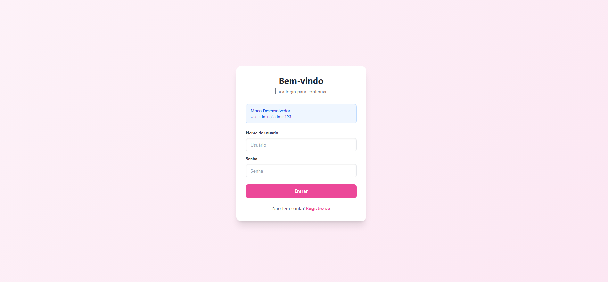
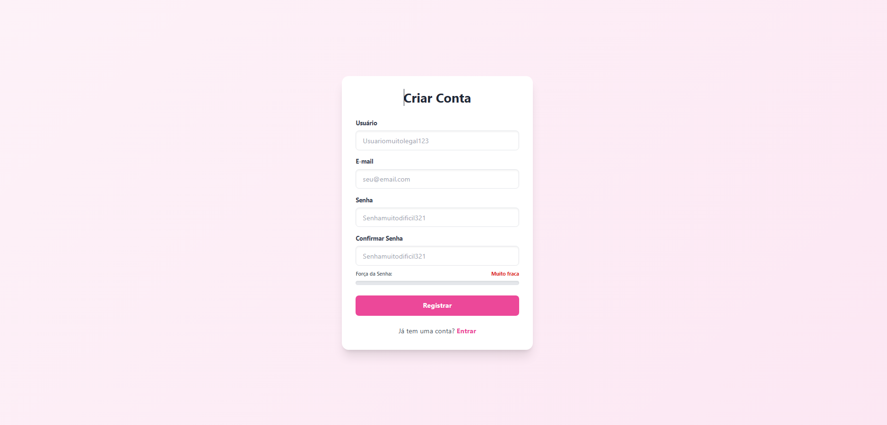
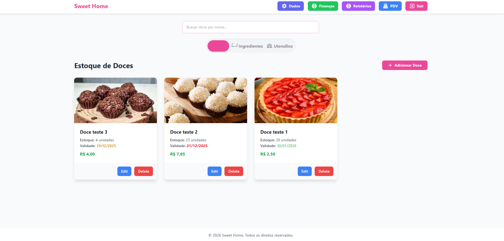
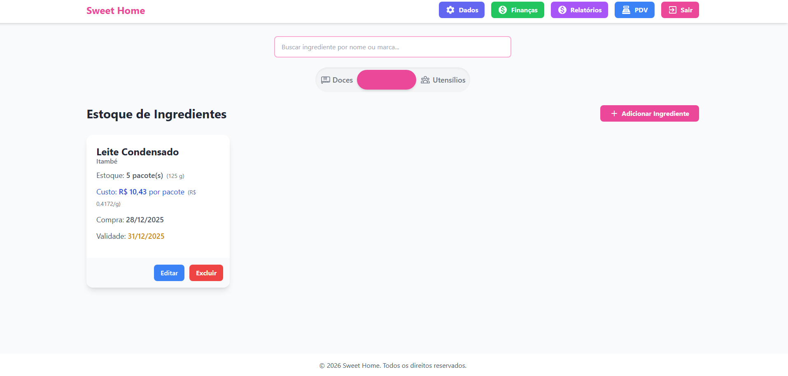
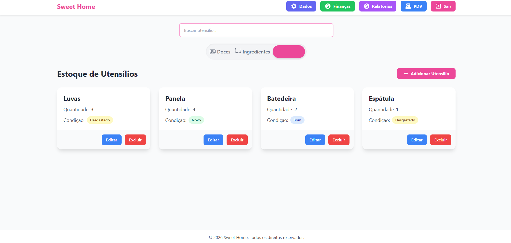
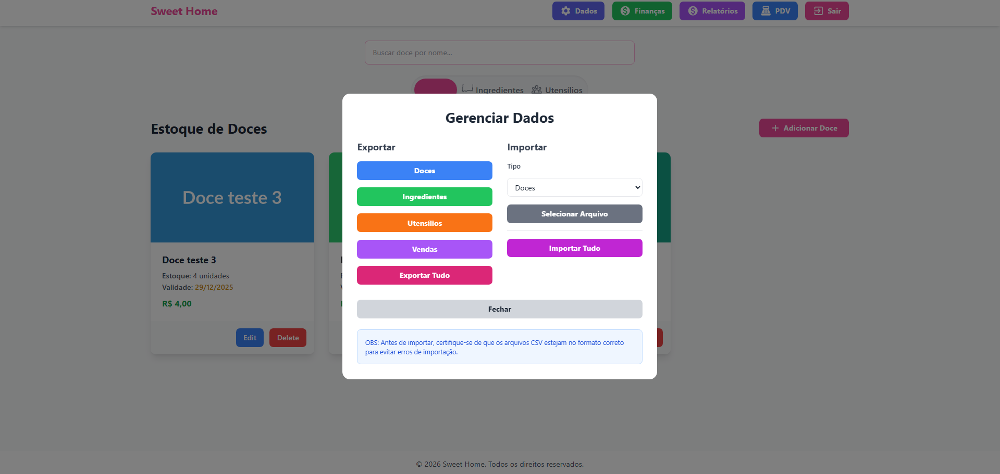
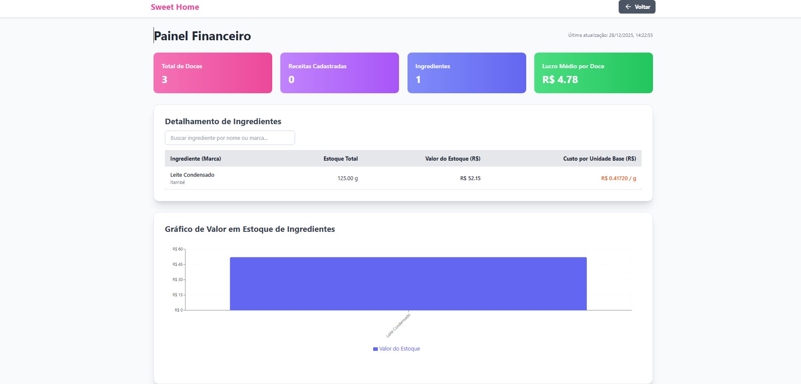
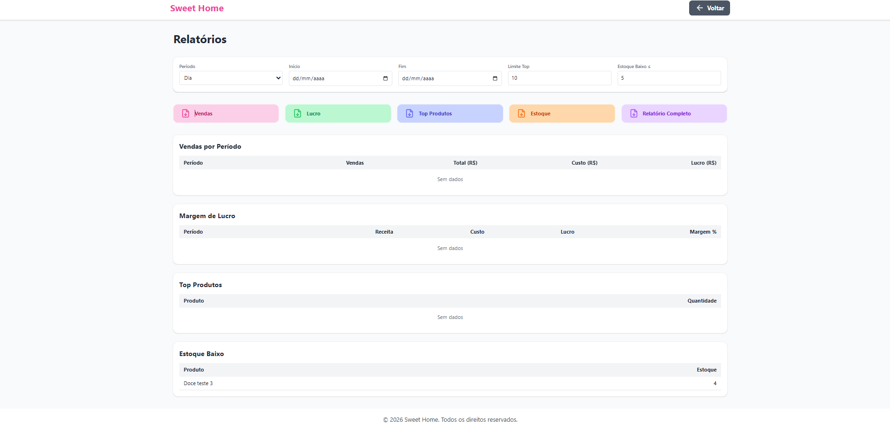
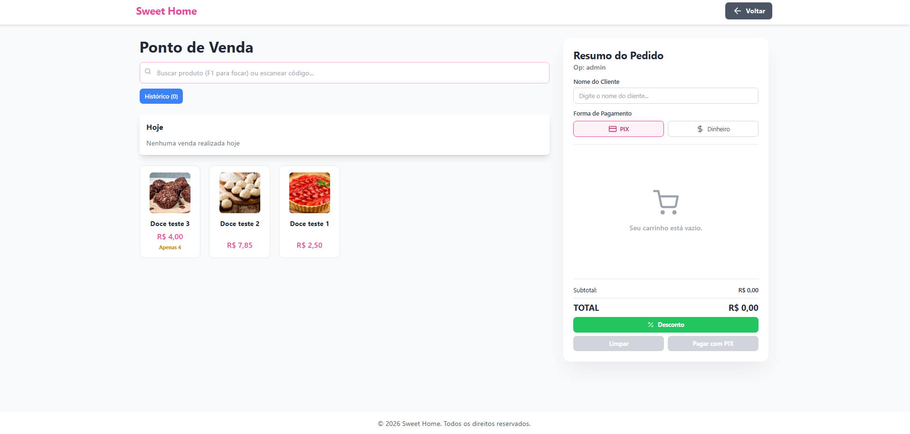

# Sweet Home 

[](https://reactjs.org/)
[](https://www.python.org/)
[](https://quart.palletsprojects.com/)
[](https://firebase.google.com/)
[](https://tailwindcss.com/)
[](LICENSE)

## Presentation
<div style="
  display: flex;
  flex-wrap: wrap;
  gap: 16px;
  justify-content: center;
">

  <figure style="flex: 1 1 280px; max-width: 250px; margin: 0;">
    
  </figure>

  <figure style="flex: 1 1 280px; max-width: 250px; margin: 0;">
    
  </figure>

  <figure style="flex: 1 1 280px; max-width: 250px; margin: 0;">
    
  </figure>

  <figure style="flex: 1 1 280px; max-width: 250px; margin: 0;">
    
  </figure>

  <figure style="flex: 1 1 280px; max-width: 250px; margin: 0;">
    
  </figure>

  <figure style="flex: 1 1 280px; max-width: 250px; margin: 0;">
    
  </figure>

  <figure style="flex: 1 1 280px; max-width: 250px; margin: 0;">
    
  </figure>

  <figure style="flex: 1 1 280px; max-width: 250px; margin: 0;">
    
  </figure>

  <figure style="flex: 1 1 280px; max-width: 250px; margin: 0;">
    
  </figure>

</div>

## Contents

- Overview
- Architecture
- Technology Stack
- Key Features
- Quick Start
- Environment Variables
- API Summary
- Screenshots
- Project Structure
- Security Notes
- Contribution
- License

---

## Overview

A full‑stack application for managing confectionery operations: inventory, point of sale, receipt generation and basic financial analytics. This repository contains experimental code and requires security hardening before production use.

---

## Architecture

- Frontend: Vite + React
- Backend: Quart (asynchronous) with authentication and sales routes
- Database: Firebase Firestore
- Receipt generation: FPDF2, barcode and QR utilities

---

## Technology Stack (summary)

- Frontend: React 18, Vite, Tailwind CSS
- Backend: Python 3.10+, Quart
- Auth: JWT (RS256)
- Database: Firebase Firestore
- PDF: FPDF2
- Barcode: python-barcode
- QR: qrcode
- Security: Werkzeug (scrypt password hashing)
- CORS: quart-cors

---

## Key Features

- Product, ingredient and kitchenware management
- Real-time POS with cart and PDF receipt generation
- Inline editable item remarks (tooltip/modal)
- Production cost and basic profitability analysis
- JWT-based authentication and scrypt password hashing

---

## Quick Start

### Frontend

1. Install dependencies:
    ```bash
    cd app
    npm install
    ```
2. Create `.env.local`:
    ```env
    VITE_API_URL=http://localhost:3001
    ```
3. Run:
    ```bash
    npm run dev
    # Frontend: http://localhost:5173
    ```

### Backend

1. Create and activate virtual environment:
    ```bash
    python -m venv venv
    # Windows: venv\Scripts\activate
    # macOS/Linux: source venv/bin/activate
    ```
2. Install dependencies and run:
    ```bash
    pip install .
    python main.py
    # Backend: http://localhost:3001
    ```

---

## Environment Variables (examples)

- Frontend (`.env.local`):
    ```env
    VITE_API_URL=http://localhost:3001
    VITE_LOG_LEVEL=info
    VITE_FIREBASE_API_KEY=your_key
    VITE_FIREBASE_AUTH_DOMAIN=your_domain
    VITE_FIREBASE_PROJECT_ID=your_project_id
    VITE_FIREBASE_STORAGE_BUCKET=your_bucket
    VITE_FIREBASE_MESSAGING_SENDER_ID=your_sender_id
    VITE_FIREBASE_APP_ID=your_app_id
    VITE_FIREBASE_DATABASE_URL=your_database_url
    ```
- Backend: RSA keys located in `src/utils/.secret/` (private_key.pem, public_key.pem). Do not commit private keys.

---

## API Summary

- **POST** `/api/auth/login` — authenticate and receive JWT
- **POST** `/api/auth/register` — validate registration data
- **GET** `/api/auth/dashboard` — authenticated user data
- **POST** `/api/sales/finish` — generate and return a receipt PDF

---

## Project Structure

- **app/** — frontend (React, Tailwind)
- **server/** — backend (Quart)
    - **src/models**
    - **src/routes**
    - **src/services**
    - **src/utils/.secret** (RSA keys)

---

## Contribution

Contributions are welcome. Open an issue to discuss significant changes before submitting a pull request.

---

